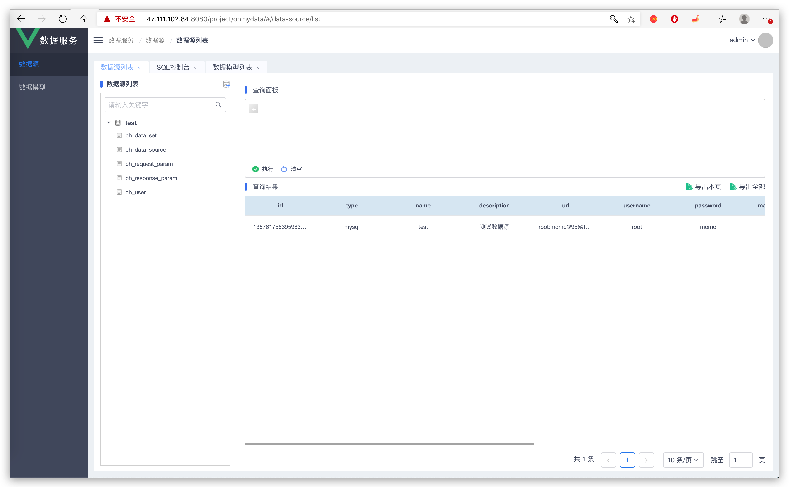

# oh-my-data

> 数据服务 —— 写个 SQL 即可发布成 API

## 前端

[ohmydata-web](https://github.com/sjhleo/ohmydata-web)

## 演示地址

```
http://47.111.102.84:8080/project/ohmydata/#/login

admin/123456
```

## 界面

### 数据源

- 管理数据库连接
- 查看表数据



### 数据集

待补充

## 数据源

采用接口抽象数据层访问，可扩展。

已实现：

- MySQL
- PostgreSQL
- ElasticSearch

待实现：

- Oracle
- ...

## 文档

待完善。

## 运行

配置文件 `config/config.yaml`

运行：

```shell
go run cmd/ohmydata/main.go
```

## Docker

```shell
docker build -t ohmydata .

docker run -it --name ohmydata \
 -e MYSQL_URL=YOUR_MYSQL_URL \
 -e REDIS_ADDR=YOUR_REDIS_ADDR \
 -e REDIS_DB=YOUR_REDIS_DB \
 -e REDIS_PASSWORD=YOUR_REDIS_PASSWORD \
 -p 9090:9090 -d ohmydata
```
